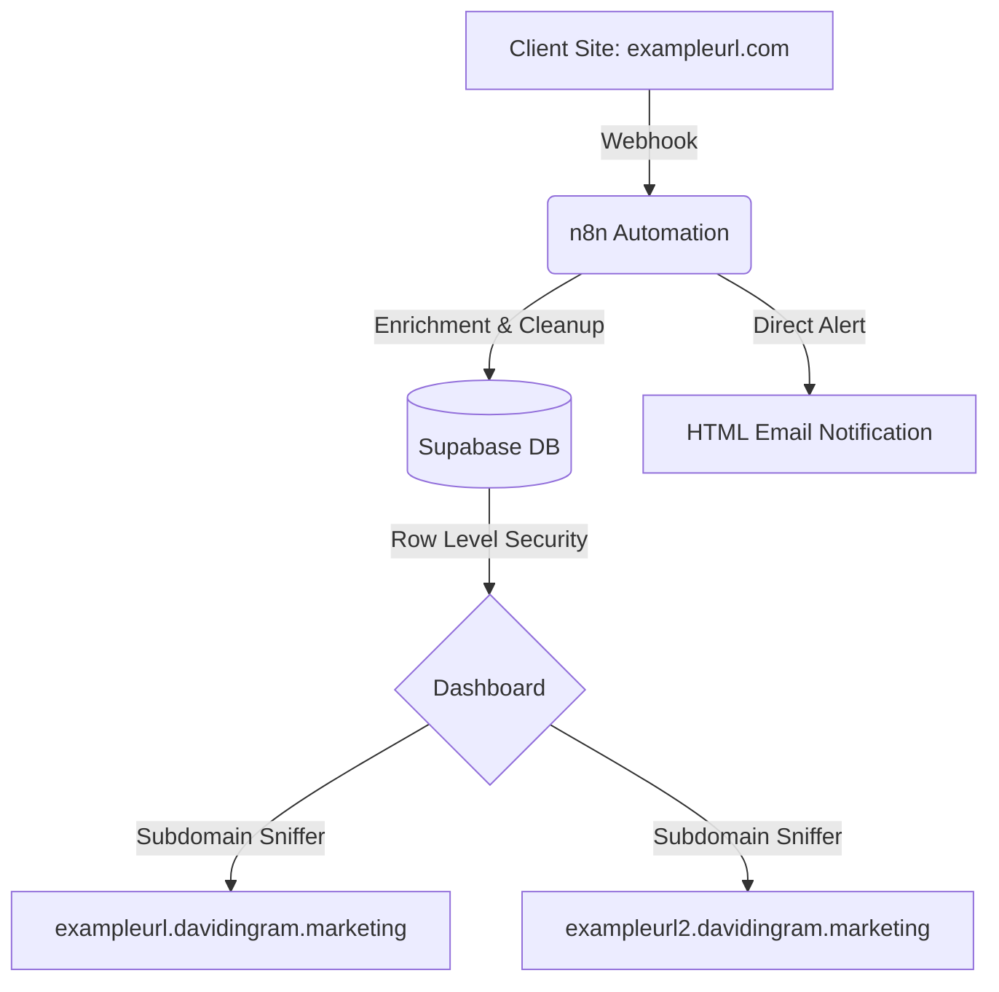

# ⚡ PROJECT: TACTICAL-INTEL-V1

### _Fractional CMO Command Center & Multi-Tenant Lead Engine_

---

## 📋 Mission Overview

**TACTICAL-INTEL-V1** is a high-performance, serverless marketing dashboard designed for Fractional CMOs. It enables the simultaneous management of multiple client lead-generation funnels through a single, secure, multi-tenant interface.

The system automates the path from **Lead Ingestion** to **Executive Briefing**, providing real-time data on Lead Velocity, ROAS, and Reputation Management.

---

## 🛠 Intelligence Stack (Tech)

| Component          | Technology                                                          |
| :----------------- | :------------------------------------------------------------------ |
| **Frontend**       | [Astro](https://astro.build/) (SSR Mode)                            |
| **Styling**        | [Tailwind CSS](https://tailwindcss.com/) (Tactical/Stealth Palette) |
| **Database**       | [Supabase](https://supabase.com/) (PostgreSQL + RLS)                |
| **Automation**     | [n8n](https://n8n.io/) (Self-hosted Workflow Engine)                |
| **Infrastructure** | [Netlify](https://www.netlify.com/) (Edge Hosting + Wildcard DNS)   |

---

## 📐 System Architecture

This project utilizes a **Wildcard Subdomain Strategy** to isolate client data while maintaining a single codebase.

